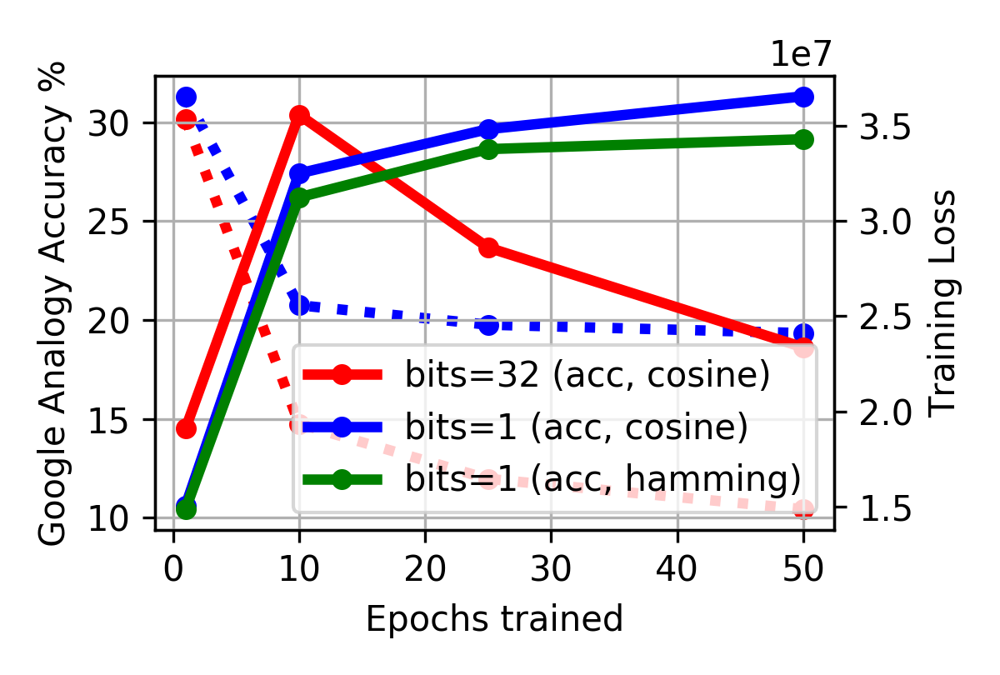
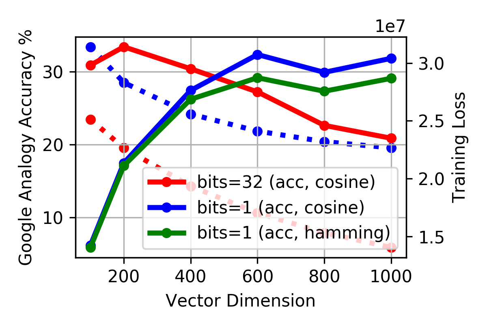
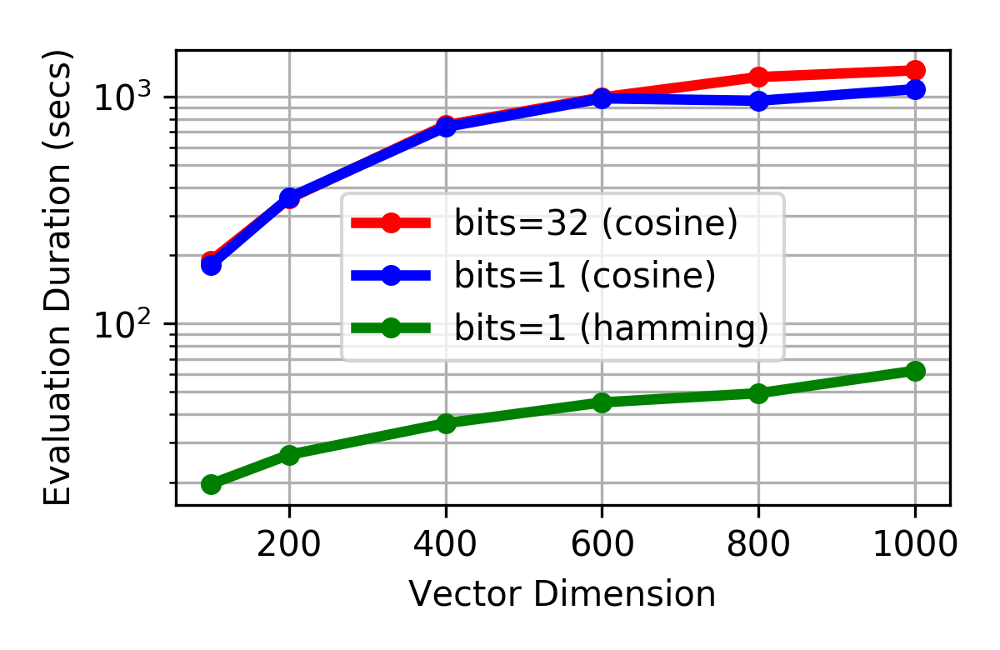

This repository contains the [evaluation](evaluation.ipynb) of the
[Word2Bits][] algorithm by [Maximilian Lam][agnusmaximus].

 [agnusmaximus]: https://github.com/agnusmaximus
 [Word2Bits]: https://github.com/agnusmaximus/Word2Bits (Quantized word vectors that take 8x-16x less space than regular word vectors)

 <p>
   <a href="figures/accuracy-iter.pdf">
     
   </a>
   <a href="figures/accuracy-size.pdf">
     
   </a>
   <a href="figures/speed-size.pdf">
     
   </a>
</p>

To reproduce our results, download the repository and install the required Python packages:

``` sh
git clone --recurse-submodules https://github.com/witiko/Word2Bits-evaluation.git
rm vectors/*.log analogy/!(Makefile) analogy_bitwise/!(Makefile)
pip install -r requirements.txt
```

Then, open the file [`evaluation.ipynb`](evaluation.ipynb) in [Jupyter
notebook][jupyter] and run all cells.

 [jupyter]: https://jupyter.org/ (Project Jupyter | Home)
