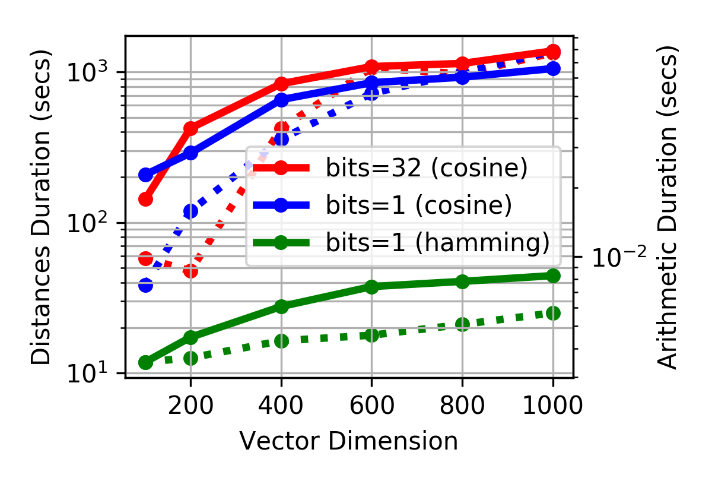

This repository contains the [evaluation](evaluation.ipynb) of the
[Word2Bits][argusmaximus/Word2Bits] algorithm by [Maximilian
Lam][agnusmaximus], which we [modified][witiko/Word2Bits] to produce true
binary vectors instead of quantized float vectors, and to use the
Hamming distance and bitwise operations instead of the cosine distance
and floating point operations.

 [agnusmaximus]: https://github.com/agnusmaximus
 [argusmaximus/Word2Bits]: https://github.com/agnusmaximus/Word2Bits (Quantized word vectors that take 8x-16x less space than regular word vectors)
 [witiko/Word2Bits]:https://github.com/Witiko/Word2Bits (Quantized word vectors that take 8x-16x less space than regular word vectors)

| Figure 1 | Figure 2 | Figure 3 |
| -- | -- | -- |
| [](figures/accuracy-iter.pdf) | [](figures/accuracy-size.pdf) | [](figures/speed-size.pdf) |
| Training accuracy (solid line) and loss (dashed line) vs epochs trained (vector dimension = 400) on 100MB of Wikipedia. Trends show that Word2Vec is prone to overfitting with many epochs of training. | Training accuracy (solid line) and loss (dashed line) vs dimension (epochs trained = 10) on 100MB of Wikipedia. Trends show that overfitting may occur with larger vector dimensions. | Duration of computing vector distances (solid line) and performing vector arithmetic (dashed line) in the evaluation of the Google analogy task. Using bitwise vector operations and Hamming distance results in up to 16× speed increase compared to float vectors and cosine similarity. |

To reproduce our results, download the repository, remove our logs, and install
the required Python packages:

``` sh
git clone --recurse-submodules https://github.com/witiko/Word2Bits-evaluation.git
rm vectors/*.log analogy/!(Makefile) analogy_bitwise/!(Makefile)
pip install -r requirements.txt
```

Then, open the file [`evaluation.ipynb`](evaluation.ipynb) in [Jupyter
notebook][jupyter] and run all cells.

 [jupyter]: https://jupyter.org/ (Project Jupyter | Home)
